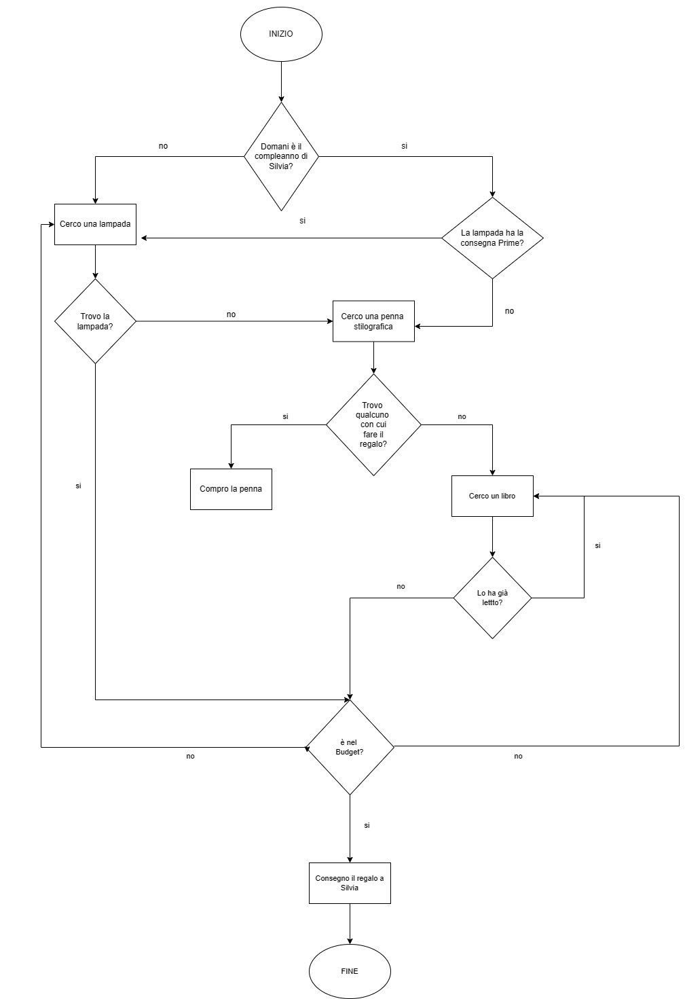

# Human Code

_diagramma di flusso_

Introduzione alla programmazione e alla sua logica. Creazione di un diagramma di flusso in team.

### Index

- [Introduzione al problema](#introduzione-al-problema)
- [Diagramma completo](#diagramma)
- [Processo logico](#processo-logico)

## Introduzione al problema

### Comprare qualcosa su Amazon

**Il regalo perfetto**

Domani è il compleanno di Silvia e non le ho ancora comprato nulla! Mi piacerebbe sorprenderla, so che le piaceva tanto quella lampada da tavolo così particolare, però la consegna non è Prime e non arriverebbe mai in tempo! Potrei optare per una bella stilografica ma sicuramente sforo il budget, forse è meglio optare per un buon libro: un classico ma so che con lei vado sul sicuro!

## Diagramma

## Processo logico

### Primo if

Chiedersi se il compleanno sia effettivamnete domani per capire se si abbia il tempo di comprare la lampada o no.

### Acquisto della lampada

La lampada sarà acquistata nel momento in cui si ha tempo di farlo. Questo avviene nelle seguenti condizioni.

- il compleanno non è domani
- la consegna gode della opzione Prime (utile solo se il compleanno è domani)

Se viene trovata la lampada si verifica che stia nel budget, altrimenti si continua a cercare.

Se non si trova si cerca un altro regalo, a partite della penna.

### Acquisto della penna stilo

La penna verrà acquistata se non si ha tempo di prendere la lampada o non si trova.

Visto il problema del budget ci si chiede se si fosse trovato qualcuno con cui fare il regalo:

- se si trova, si compra la penna

- se non si trova si va avanti a cercare (varando sulla soluzione libro)

In questo caso non si pone la questione budget perchè l' acquisatare la penna implica che questa problematica è stata già risolta.

### Acquisto del libro

Nel caso in cui non si trovi qualcuno con cui acquistare la penna si cerca un libro, a cui si applica una condizione.

- Se il libro è già stato letto da Silvia se ne cerca un altro

- Se il libro non è mai stato letto da Silvia si procede

Come per la lampada si effettua un controllo del budget che in caso di esito negativo ci rimanda alla ricerca del libro.

### Fine

Se la condizione budget viene rispettata si arriva alla fine del problema.
